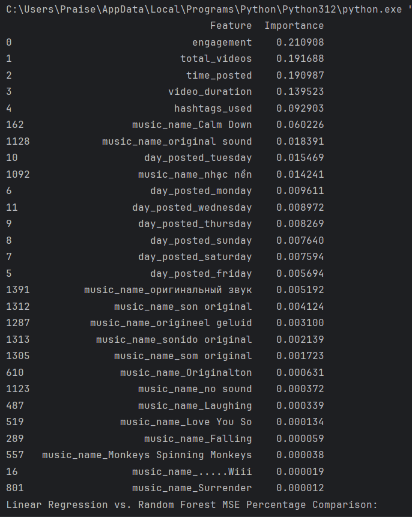
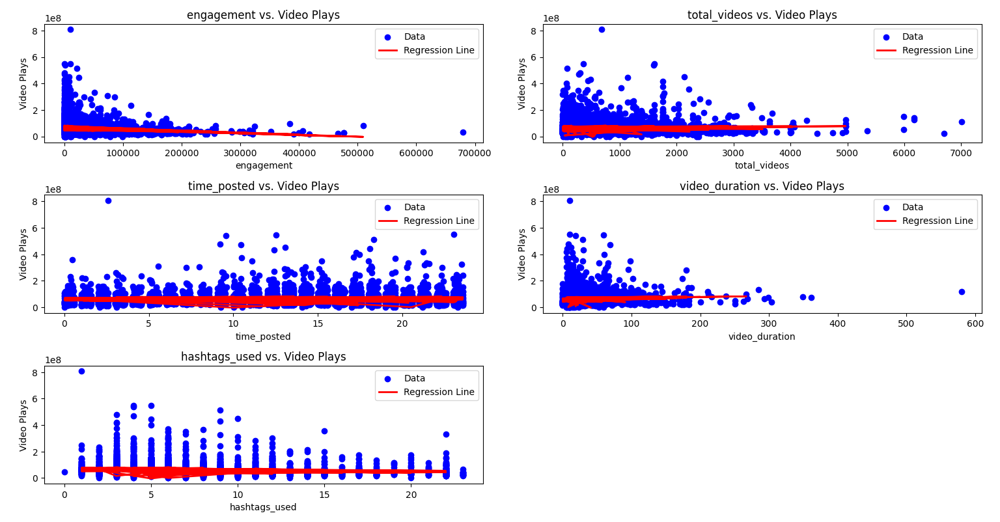

# TikTok Viral Predictor

This project aims to analyze TikTok data to identify features strongly correlated with higher video plays. Here's a breakdown of the project's process, intentions, and outcomes:

## Introduction

TikTok has emerged as a popular platform for short-form video content, and understanding the factors contributing to a video's virality can be crucial for content creators and marketers. This project delves into the analysis of TikTok data to uncover patterns and predictors of video success.

---

### Skills Learned

**Hard Skills:**
- **Data Scraping**: Utilized Apify for web scraping TikTok data, gaining some exposure to data collection from online platforms.
- **Data Cleaning and Preprocessing**: Conducted data cleaning procedures, including handling missing values, simplifying features, and deconstructing timestamp data, to prepare the dataset for analysis.
- **Machine Learning Modeling**: Employed Random Forest Regression and Multiple Linear Regression models for predictive analysis, demonstrating competence in machine learning algorithms.
- **Hyperparameter Tuning**: Utilized RandomizedSearchCV to optimize model hyperparameters, enhancing model performance and demonstrating understanding of parameter tuning techniques.
- **Data Visualization**: Utilized Matplotlib to visualize feature importance and regression results, developing skills in data visualization for communication of insights.

**Soft Skills:**
- **Project Management**: Demonstrated project management skills by dividing the project into manageable tasks, setting clear objectives, and fufiling them.
- **Critical Thinking**: Applied critical thinking skills to identify key features influencing TikTok video virality and propose potential areas for improvement in model performance.
- **Problem Solving**: Addressed challenges such as outlier detection, model optimization, and feature selection, demonstrating adaptability and problem-solving abilities.

### Libraries Used

- **pandas**: Utilized for data manipulation and analysis, including loading datasets, cleaning data, and organizing tabular data structures.
- **numpy**: Employed for numerical operations and array manipulations, facilitating mathematical computations and statistical analysis.
- **matplotlib**: Utilized for data visualization, generating plots and graphs to illustrate feature importance, regression results, and data distributions.
- **scikit-learn**: Leveraged for machine learning tasks, including model training, evaluation, and hyperparameter tuning, utilizing functionalities for regression analysis.

---

### Data Collection and Preprocessing

- **Data Source**: Apify was utilized to scrape TikTok data, resulting in a dataset with dimensions (4386, 1294).
- **Data Cleaning**: 
  - Unnecessary features were discarded.
  - Columns with missing data were dropped.
  - Hashtags were simplified to explore the relationship between the number of hashtags and video plays.
  - The ISO time was deconstructed into day of the week and time in decimal.
- **Final Dataset**: After cleaning, the dataset had dimensions (3777, 21).

---

### Feature Selection and Model Training

- **Features of Interest**:
  - Engagement
  - Total videos
  - Day posted
  - Time posted
  - Video duration
  - Music name
  - Hashtags used

- **Model Selection**: 
  - A Random Forest model was chosen for its ability to handle complex relationships and feature interactions.
  - Multiple Linear Regression was also explored for comparison.

- **Model Performance**:
  - Initially, the Random Forest model exhibited a mean squared error (MSE) of 98%.
  - After implementing hyperparameter tuning, the MSE dropped to approximately 94%.
  - Both models performed suboptimally, indicating the need for further refinement in data preprocessing and feature selection.

---

### Insights from Feature Importance

- Feature importance analysis provided insights into the predictors of virality.
  
- Key predictors included engagement, total videos, time posted, video duration, and hashtags used.

---

### Analysis of Linear Regression Results

- Outliers in the data were observed, suggesting the need for outlier detection and handling.
- Analysis revealed diminishing effects of engagement, video duration, and total videos on video plays.
- The presence of four hashtags seemed to be optimal for maximizing video plays.

---

### Conclusion and Future Work

- Despite initial setbacks, this project provides valuable insights into the factors influencing TikTok video virality.
- Future work involves:
  - Refinement of data preprocessing techniques.
  - Exploration of alternative models and feature engineering strategies.
  - Addressing outliers and further analyzing the impact of individual features.
